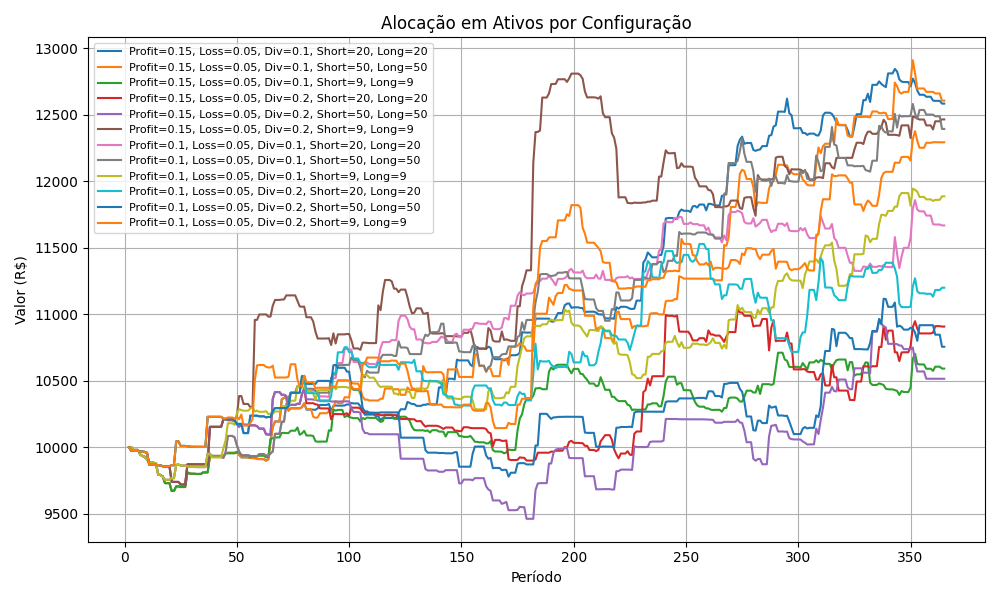

# PortBackRank

PortBackRank is an investment strategy evaluator that leverages backtesting to assess various trading strategies. The tool allows you to optimize parameters, rank assets, and analyze the best-performing portfolios. By using advanced backtesting techniques, PortBackRank enables investors and analysts to simulate investment strategies over historical data to evaluate their potential effectiveness in real-world scenarios.

## Downloads

- [PortBackRank Implementation](https://portbackrank.github.io/PortBackRank/)

For installation and usage details, please refer to the [Installation Guide](https://portbackrank.github.io/PortBackRank/).

## Related Publications

## Project Details

PortBackRank was developed as a tool for backtesting investment strategies that rely on the ranking of assets based on specific criteria. The core functionality of the tool is to simulate how different investment strategies, guided by asset rankings, would have performed in the past. By ranking assets according to various factors (such as historical performance, moving average, and other market indicators).

### Key Features:
- **Backtesting Framework**: The tool enables you to backtest investment strategies over historical data, assessing how well your strategy would have performed.
- **Asset Ranking**: Using custom ranking algorithms, assets are ranked based on predefined metrics. This helps simulate different portfolio compositions and analyze the potential returns.
- **Optimization**: The system allows users to optimize parameters related to the asset ranking criteria, making it easier to discover the most effective strategies.
- **Performance Analysis**: PortBackRank provides detailed performance metrics, such as return, risk, and volatility, to evaluate the success of your strategies.

### How it Works:
1. **Ranking Assets**: First, assets are ranked using a custom ranking algorithm based on historical data and predefined factors.
2. **Portfolio Simulation**: The ranked assets are then used to simulate a portfolio, and the performance of this portfolio is tracked over time.
3. **Backtesting**: The strategy is backtested across different time periods to assess its historical effectiveness.
4. **Analysis**: Performance metrics are calculated and displayed, allowing you to determine the success of your investment strategy.

## Example Screenshot

